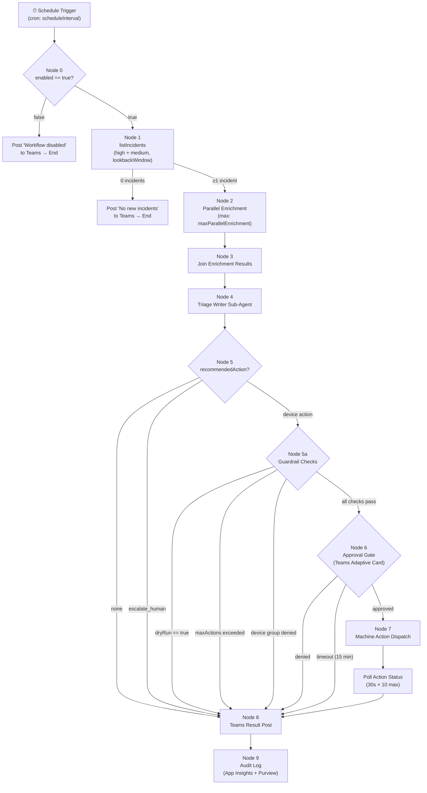

# Security Triage Workflow Agent Specification

## Overview

This document specifies a Microsoft Foundry workflow agent that performs
scheduled security incident enrichment and automated response for the
pilot deployment. The workflow runs on a configurable schedule (default:
every 4 hours), pulls active high- and medium-severity incidents from
Microsoft Graph Security API, enriches each incident with correlated KQL
data from Advanced Hunting, generates triage recommendations via a
sub-agent call, and — when a response action is warranted — gates
execution behind a human approval card in Teams before dispatching
Defender for Endpoint machine actions.

The workflow is designed for a pilot environment with conservative
guardrails: a kill switch, a dry-run mode (on by default), a cap on
actions per run, and device-group allow-listing. All runs post a
structured summary to a Teams channel and emit structured telemetry to
Application Insights. Purview audit logging is automatic via the agent's
PIM-activated Entra identity.

## Workflow Graph



## Variables

| Variable | Type | Default | Description |
|---|---|---|---|
| `enabled` | boolean | `true` | Kill switch. Set `false` to stop all runs immediately at Node 0. |
| `dryRun` | boolean | `true` | When `true`, logs intended actions without executing. Posts with `[DRY RUN]` prefix. |
| `maxActionsPerRun` | integer | `3` | Maximum response actions dispatched per run. Excess recommendations route to `escalate_human`. |
| `maxParallelEnrichment` | integer | `5` | Maximum concurrent enrichment query batches in the fan-out node. |
| `allowedDeviceGroups` | string[] | `["Pilot-Workstations"]` | Defender device groups where machine actions are permitted. Actions targeting devices outside these groups route to `escalate_human`. |
| `lookbackWindow` | duration | `PT4H` | ISO 8601 duration. How far back to query for active incidents in Node 1. |
| `approvalTimeoutMinutes` | integer | `15` | Minutes to wait for approval before auto-denying. |
| `approverGroup` | string | `""` | Entra group ObjectId for the on-call approver group. Mentioned in approval cards. |
| `teamsChannelId` | string | `""` | Teams channel ID where result posts and approval cards are sent. |
| `scheduleInterval` | string | `"0 */4 * * *"` | Cron expression for workflow run frequency. |

## Node Specifications

### Node 0: Kill Switch Check

| Property | Value |
|---|---|
| Type | Condition |
| Input | Variable: `enabled` |
| Logic | If `enabled == false`, terminate immediately |

When `enabled` is `false`, the workflow posts a single message to the
configured Teams channel — "Workflow disabled by kill switch — run
skipped at {utcTimestamp}" — and terminates. No further nodes execute.

This check is the **first** node in every run. It exists so operators can
halt all automated activity with a single variable change, without
undeploying the workflow or modifying the schedule.

---

### Node 1: List Active Incidents

| Property | Value |
|---|---|
| Type | Tool call |
| Tool | `listIncidents` (Graph Security API) |
| Filter | `status eq 'active' and severity in ('high','medium') and createdDateTime ge {lookbackWindow}` |
| Top | `10` |
| OrderBy | `severity asc, createdDateTime desc` |

The `severity asc` ordering puts `high` before `medium` (Graph Security
API sorts severity enums alphabetically: critical < high < medium <
low). Within each severity band, most recent incidents appear first.

The `lookbackWindow` is subtracted from the current UTC time to produce
the `createdDateTime ge` filter value. Default `PT4H` matches the
default 4-hour schedule so incidents are not re-processed across runs.

**On empty result:** Post "No new incidents in lookback window
({lookbackWindow}) — run completed at {utcTimestamp}" to Teams channel
and end. No further nodes execute.

---

### Node 2: Fan-Out Enrichment

| Property | Value |
|---|---|
| Type | Parallel for-each |
| Input | Incident list from Node 1 |
| Max parallelism | `maxParallelEnrichment` (default: 5) |
| Per-iteration calls | 4 KQL queries via Advanced Hunting |

For each incident, run the four KQL queries described in
[KQL Enrichment Patterns](#kql-enrichment-patterns). Queries 3 and 4 are
conditional — they only execute when device or user entities
(respectively) are found in the Query 2 results.

Each enrichment batch has a per-incident timeout of 60 seconds. If any
individual query fails or times out, the enrichment result for that query
is set to `null` and a warning is attached to the incident's enrichment
payload. The workflow continues — partial enrichment is better than no
enrichment.

---

### Node 3: Join Enrichment Results

| Property | Value |
|---|---|
| Type | Data join |
| Input | Incident metadata (Node 1) + enrichment results (Node 2) |

Produces a unified per-incident summary object:

```jsonc
{
  "incidentId": "string",
  "displayName": "string",
  "severity": "high | medium",
  "status": "active",
  "alertCount": 0,
  "affectedDevices": [
    { "deviceId": "string", "deviceName": "string", "deviceGroup": "string" }
  ],
  "affectedUsers": [
    { "userId": "string", "upn": "string" }
  ],
  "deviceTimeline": [
    { "deviceId": "string", "actionType": "string", "eventCount": 0 }
  ],
  "identityRisks": [
    { "upn": "string", "riskLevel": "string", "riskySignInCount": 0 }
  ],
  "enrichmentTimestamp": "ISO 8601 datetime"
}
```

If an enrichment query returned `null` (failure/timeout), the
corresponding array is empty and the summary object includes
`"enrichmentWarnings": ["query_name: reason"]`.

---

### Node 4: Triage Writer (Sub-Agent Call)

| Property | Value |
|---|---|
| Type | Agent call |
| Target | Triage agent (or lightweight summarizer sub-agent) |
| Input | Joined enrichment data from Node 3 |

The sub-agent evaluates each incident's enrichment data and returns a
triage recommendation:

```jsonc
{
  "summary": "string — one-paragraph natural-language summary",
  "recommendedAction": "none | isolate | scan | collectForensics | restrictExecution | escalate_human",
  "confidence": "high | medium | low",
  "reasoning": "string — why this action was chosen",
  "targetMachineId": "string | null",
  "targetDeviceGroup": "string | null"
}
```

**Confidence override:** If `confidence` is `"low"`, the workflow forces
`recommendedAction` to `"escalate_human"` regardless of the sub-agent's
recommendation. This is a hard rule — the sub-agent cannot bypass it.

---

### Node 5: Conditional Branch

| Property | Value |
|---|---|
| Type | Switch / condition |
| Input | Triage recommendation from Node 4 |

Routing logic per incident:

| Condition | Route |
|---|---|
| `recommendedAction == "none"` | Skip to Node 8 (Teams post only) |
| `recommendedAction == "escalate_human"` | Skip to Node 8 with escalation flag |
| `recommendedAction` is a device action | Proceed to Node 5a (guardrail validation) |

Device actions are: `isolate`, `scan`, `collectForensics`,
`restrictExecution`.

---

### Node 5a: Guardrail Validation

| Property | Value |
|---|---|
| Type | Condition chain (sequential) |
| Input | Triage recommendation + workflow variables |

Three checks run in order. The first failing check short-circuits — the
remaining checks do not execute.

**Check 1 — Dry Run:**
If `dryRun == true`, log the intended action and route to Node 8. The
Teams post includes a `[DRY RUN]` prefix on the action line:
`[DRY RUN] Would isolate device {deviceName} ({machineId})`.

**Check 2 — Action Budget:**
Increment a per-run counter. If the counter exceeds
`maxActionsPerRun`, route the recommendation to `escalate_human` with
reason: "Max actions per run ({maxActionsPerRun}) reached."

**Check 3 — Device Group Allow-List:**
Check whether `targetDeviceGroup` is present in the
`allowedDeviceGroups` array. If not, route to `escalate_human` with
reason: "Device not in allowed group — target group '{targetDeviceGroup}'
is not in [{allowedDeviceGroups}]."

All three checks must pass before the incident proceeds to the approval
gate (Node 6).

---

### Node 6: Approval Gate

| Property | Value |
|---|---|
| Type | Logic App connector → Teams Adaptive Card |
| Timeout | `approvalTimeoutMinutes` (default: 15 minutes) |
| Mention | `@{approverGroup}` Entra group |

Posts an Adaptive Card to the Teams channel and waits for a response.
See [Approval Gate Design](#approval-gate-design) for the full card
schema.

| Response | Behavior |
|---|---|
| **Approve** | Record approver identity and timestamp. Proceed to Node 7. |
| **Deny** | Record denial reason from the card's optional text input. Log to telemetry. Post denial to Teams. End this incident's branch. |
| **Escalate** | Record escalation. Route to Node 8 with escalation flag and reason "Manually escalated by {approverUpn}." |
| **Timeout** | Treat as deny. Log "Approval timed out after {approvalTimeoutMinutes} minutes." Route to `escalate_human` via Node 8. |

---

### Node 7: Machine Action Dispatch

| Property | Value |
|---|---|
| Type | Tool call — Defender for Endpoint |
| Input | Approved recommendation from Node 6 |

Action-to-API mapping:

| recommendedAction | API Call | Parameters |
|---|---|---|
| `isolate` | `isolateMachine` | `IsolationType: "Selective"` |
| `scan` | `runAntiVirusScan` | `ScanType: "Quick"` |
| `collectForensics` | `collectInvestigationPackage` | — |
| `restrictExecution` | `restrictAppExecution` | — |

Every API call includes a `Comment` field:

```
Automated action by Security Triage Workflow Agent.
Incident: {incidentId} | Run: {workflowRunId}
Approved by: {approverUpn} at {approvalTimestamp}
Agent identity: {agentEntraId}
```

**Post-dispatch polling:** After the action is submitted, poll
`getMachineActionStatus` every 30 seconds for up to 10 polls (5 minutes
total). Record the final status (`Succeeded`, `Failed`, `Pending`,
`TimeOut`).

**On failure:** Log the error details. Post the failure to Teams. Do
**not** retry automatically — failed actions require human review.

---

### Node 8: Teams Result Post

| Property | Value |
|---|---|
| Type | Teams channel message (Adaptive Card) |
| Channel | `teamsChannelId` |

Posts a run summary to the configured Teams channel. See
[Teams Output Format](#teams-output-format) for the full template.

---

### Node 9: Audit Log

| Property | Value |
|---|---|
| Type | Logging / telemetry |
| Targets | Application Insights, Purview (automatic) |

Writes structured telemetry for every incident processed in the run.
See [Error Handling — Telemetry Schema](#telemetry-schema) for the
field definitions.

## KQL Enrichment Patterns

All queries use Advanced Hunting via the Graph Security API. The
`Timestamp > ago(4h)` filter aligns with the default `lookbackWindow`
but is dynamically set to match the variable's value at runtime.

### Query 1: Alert Correlation

Returns all alerts linked to the incident, ordered by severity.

```kql
AlertInfo
| where Timestamp > ago(4h)
| where Title has "{incidentDisplayName}"
| project AlertId, Title, Severity, Category, CreationTime=Timestamp
| order by Severity asc
```

**Substitutions:** `{incidentDisplayName}` — the incident's display name
from Node 1. The `has` operator performs a case-insensitive substring
match.

### Query 2: Affected Entities

Returns entity types and counts per alert. Used to determine whether
Queries 3 and 4 should execute.

```kql
AlertEvidence
| where Timestamp > ago(4h)
| where AlertId in ({alertIds})
| summarize Entities=make_set(EntityType), Count=count() by AlertId
```

**Substitutions:** `{alertIds}` — comma-separated, quoted alert IDs from
Query 1 results.

### Query 3: Device Timeline (Conditional)

Executes only when Query 2 results contain device entities. Returns the
top 20 event-type summaries for affected devices.

```kql
DeviceEvents
| where Timestamp > ago(4h)
| where DeviceId in ({deviceIds})
| where ActionType in ("ProcessCreated", "FileCreated", "ConnectionSuccess", "RegistryValueSet")
| summarize EventCount=count() by DeviceId, ActionType
| order by EventCount desc
| take 20
```

**Substitutions:** `{deviceIds}` — device IDs extracted from Query 2's
entity results.

### Query 4: Identity Signals (Conditional)

Executes only when Query 2 results contain user entities. Returns
risky sign-in counts per user.

```kql
AADSignInEventsBeta
| where Timestamp > ago(4h)
| where AccountObjectId in ({userIds})
| where RiskLevelDuringSignIn in ("high", "medium")
| summarize RiskySignIns=count() by AccountUpn, RiskLevelDuringSignIn
```

**Substitutions:** `{userIds}` — user object IDs extracted from Query 2's
entity results.

## Approval Gate Design

The approval gate uses a Teams Adaptive Card posted via Logic App
connector. The card schema follows Adaptive Card v1.5.

### Adaptive Card Schema

```json
{
  "type": "AdaptiveCard",
  "$schema": "http://adaptivecards.io/schemas/adaptive-card.json",
  "version": "1.5",
  "body": [
    {
      "type": "TextBlock",
      "text": "🔴 Security Action Approval Required",
      "weight": "Bolder",
      "size": "Large",
      "wrap": true
    },
    {
      "type": "FactSet",
      "facts": [
        { "title": "Incident", "value": "{incidentId} — {displayName}" },
        { "title": "Severity", "value": "{severity}" },
        { "title": "Recommended Action", "value": "{recommendedAction}" },
        { "title": "Target Device", "value": "{deviceName} ({machineId})" },
        { "title": "Device Group", "value": "{targetDeviceGroup}" },
        { "title": "Confidence", "value": "{confidence}" }
      ]
    },
    {
      "type": "TextBlock",
      "text": "**Reasoning:**",
      "wrap": true
    },
    {
      "type": "TextBlock",
      "text": "{reasoning}",
      "wrap": true
    },
    {
      "type": "TextBlock",
      "text": "**Incident Summary:**",
      "wrap": true
    },
    {
      "type": "TextBlock",
      "text": "{summary}",
      "wrap": true
    },
    {
      "type": "TextBlock",
      "text": "<at>{approverGroup}</at> — please review and respond within {approvalTimeoutMinutes} minutes.",
      "wrap": true
    },
    {
      "type": "Input.Text",
      "id": "denialReason",
      "label": "Reason (required if denying)",
      "isMultiline": true,
      "placeholder": "Why is this action being denied?"
    }
  ],
  "actions": [
    {
      "type": "Action.Submit",
      "title": "✅ Approve",
      "data": { "action": "approve" },
      "style": "positive"
    },
    {
      "type": "Action.Submit",
      "title": "❌ Deny",
      "data": { "action": "deny" },
      "style": "destructive"
    },
    {
      "type": "Action.Submit",
      "title": "⬆️ Escalate",
      "data": { "action": "escalate" }
    }
  ]
}
```

### Approval Logic

1. The Logic App connector posts the card and creates a pending approval
   record with a correlation ID tied to `workflowRunId` + `incidentId`.
2. The workflow pauses this incident's branch and waits for a callback.
3. On response, the Logic App returns `{ action, respondentUpn,
   respondentTimestamp, denialReason? }`.
4. If no response arrives within `approvalTimeoutMinutes`, the Logic App
   fires a timeout callback with `{ action: "timeout" }`.

## Error Handling

### Per-Node Error Behavior

| Node | Failure Mode | Behavior |
|---|---|---|
| Node 0 | Variable read failure | Treat as `enabled = false`. Post error to Teams. Terminate. |
| Node 1 | Graph API error (5xx, throttle) | Retry once after 10 seconds. On second failure, post error to Teams and terminate. |
| Node 1 | Graph API auth failure (401/403) | Post "Authentication failed — check agent identity and PIM activation" to Teams. Terminate. Do not retry. |
| Node 2 | Individual KQL query timeout/failure | Set that query's result to `null`. Attach warning to enrichment payload. Continue with partial data. |
| Node 2 | All 4 queries fail for an incident | Mark incident as `enrichmentFailed`. Skip to Node 8 with error flag. |
| Node 3 | Schema validation failure | Log malformed payload. Skip affected incident. Continue with remaining incidents. |
| Node 4 | Sub-agent timeout (60s) | Default to `recommendedAction: "escalate_human"` with `confidence: "low"` and `reasoning: "Triage sub-agent timed out"`. |
| Node 4 | Sub-agent returns invalid schema | Same as timeout — fall back to escalation. |
| Node 6 | Logic App connector failure | Log error. Route to `escalate_human`. Post connector failure to Teams. |
| Node 7 | Defender API error (4xx/5xx) | Log error with full response body. Post failure to Teams. Do **not** retry. |
| Node 7 | Polling timeout (5 min) | Record final status as `Pending`. Post "Action submitted but status unconfirmed after 5 minutes" to Teams. |
| Node 8 | Teams post failure | Log to Application Insights. Retry once. If still failing, the run completes but the Teams post is lost — telemetry in App Insights is the fallback record. |

### Telemetry Schema

Every incident processed in a run emits a structured telemetry event to
Application Insights:

```jsonc
{
  "workflowRunId": "guid",
  "incidentId": "string",
  "severity": "high | medium",
  "recommendedAction": "none | isolate | scan | collectForensics | restrictExecution | escalate_human",
  "confidence": "high | medium | low",
  "guardrailOutcome": "passed | dryRun | maxActionsExceeded | deviceGroupDenied | notApplicable",
  "approvalOutcome": "approved | denied | timeout | escalated | notApplicable",
  "approverUpn": "string | null",
  "actionOutcome": "succeeded | failed | pending | timeout | notApplicable",
  "defenderActionId": "string | null",
  "enrichmentWarnings": ["string"],
  "durationMs": 0,
  "timestamp": "ISO 8601"
}
```

## Pilot Guardrails

Each guardrail is enforced at a specific node. This section maps
guardrails to their enforcement points and describes the failure mode.

### Kill Switch (`enabled`)

- **Enforcement:** Node 0, first check in every run.
- **Behavior when tripped:** Immediate termination. Posts to Teams.
  No incidents are fetched, no enrichment runs, no actions are
  dispatched.
- **How to activate:** Set `enabled = false` in the workflow variables.
  Takes effect on the next scheduled run (or immediately if a run is
  in the kill-switch check phase).

### Dry Run (`dryRun`)

- **Enforcement:** Node 5a, Check 1.
- **Behavior when active:** The full pipeline runs — incidents are
  fetched, enriched, triaged, and guardrails are evaluated — but no
  approval card is sent and no machine action is dispatched. The Teams
  post includes `[DRY RUN]` prefixed to each action line, showing
  exactly what *would* have happened.
- **Default:** `true`. Must be explicitly set to `false` to enable
  live actions. This ensures new deployments are safe by default.

### Action Budget (`maxActionsPerRun`)

- **Enforcement:** Node 5a, Check 2.
- **Behavior when exceeded:** The excess recommendation is rerouted
  to `escalate_human` with reason "Max actions per run
  ({maxActionsPerRun}) reached." The counter is per-run, not
  per-incident — if two incidents each recommend an action and the
  budget is 3, both proceed. If a fourth action is recommended in
  the same run, it is escalated.
- **Counter reset:** Every new workflow run starts with a counter of 0.

### Device Group Allow-List (`allowedDeviceGroups`)

- **Enforcement:** Node 5a, Check 3.
- **Behavior when denied:** The recommendation is rerouted to
  `escalate_human` with reason identifying the disallowed device
  group. The operator sees exactly which group was targeted and which
  groups are in the allow-list.
- **Scope:** Only affects machine actions (`isolate`, `scan`,
  `collectForensics`, `restrictExecution`). Recommendations of
  `"none"` or `"escalate_human"` bypass this check entirely.

### Parallel Enrichment Cap (`maxParallelEnrichment`)

- **Enforcement:** Node 2, fan-out concurrency limit.
- **Behavior:** Limits the number of concurrent incident enrichment
  batches. Excess incidents queue and process as slots free up.
  Prevents throttling against the Advanced Hunting API.

## Teams Output Format

The run summary is posted as an Adaptive Card to the configured Teams
channel (`teamsChannelId`).

### Card Structure

```json
{
  "type": "AdaptiveCard",
  "$schema": "http://adaptivecards.io/schemas/adaptive-card.json",
  "version": "1.5",
  "body": [
    {
      "type": "TextBlock",
      "text": "Security Triage Workflow — Run Summary",
      "weight": "Bolder",
      "size": "Large"
    },
    {
      "type": "FactSet",
      "facts": [
        { "title": "Run ID", "value": "{workflowRunId}" },
        { "title": "Timestamp", "value": "{utcTimestamp}" },
        { "title": "Incidents Processed", "value": "{incidentCount}" },
        { "title": "Actions Dispatched", "value": "{actionCount}" },
        { "title": "Escalations", "value": "{escalationCount}" },
        { "title": "Mode", "value": "{dryRun ? 'DRY RUN' : 'LIVE'}" }
      ]
    },
    {
      "type": "TextBlock",
      "text": "---"
    },
    {
      "type": "Container",
      "$comment": "Repeated per incident",
      "items": [
        {
          "type": "ColumnSet",
          "columns": [
            {
              "type": "Column",
              "width": "auto",
              "items": [
                {
                  "type": "TextBlock",
                  "text": "{severityBadge}",
                  "color": "{severity == 'high' ? 'Attention' : 'Warning'}"
                }
              ]
            },
            {
              "type": "Column",
              "width": "stretch",
              "items": [
                {
                  "type": "TextBlock",
                  "text": "{displayName}",
                  "weight": "Bolder",
                  "wrap": true
                }
              ]
            }
          ]
        },
        {
          "type": "TextBlock",
          "text": "{summary}",
          "wrap": true
        },
        {
          "type": "FactSet",
          "facts": [
            { "title": "Recommendation", "value": "{recommendedAction}" },
            { "title": "Status", "value": "{actionStatus}" },
            { "title": "Confidence", "value": "{confidence}" }
          ]
        }
      ]
    },
    {
      "type": "TextBlock",
      "text": "---"
    },
    {
      "type": "ActionSet",
      "actions": [
        {
          "type": "Action.OpenUrl",
          "title": "View in Purview Audit",
          "url": "https://compliance.microsoft.com/auditlogsearch?searchId={purviewSearchId}"
        },
        {
          "type": "Action.OpenUrl",
          "title": "Workflow Run History",
          "url": "{foundryWorkflowRunUrl}"
        }
      ]
    }
  ]
}
```

### Status Labels

Each incident's `actionStatus` field uses one of these labels:

| Label | Meaning |
|---|---|
| `✅ Action Succeeded` | Machine action dispatched and confirmed successful. |
| `❌ Action Failed` | Machine action dispatched but Defender reported failure. |
| `⏳ Action Pending` | Machine action dispatched but status unconfirmed after polling. |
| `🔒 Approved & Dispatched` | Action was approved and sent (polling still in progress). |
| `🚫 Denied` | Approval was denied by a human reviewer. |
| `⏱ Approval Timed Out` | No response within `approvalTimeoutMinutes`. Treated as deny. |
| `⬆️ Escalated` | Routed to human escalation (low confidence, guardrail block, or manual). |
| `[DRY RUN] {action}` | Dry-run mode — shows what would have been dispatched. |
| `— No Action` | Triage recommended no response action. |
| `⚠️ Enrichment Failed` | Enrichment queries failed; incident skipped. |
